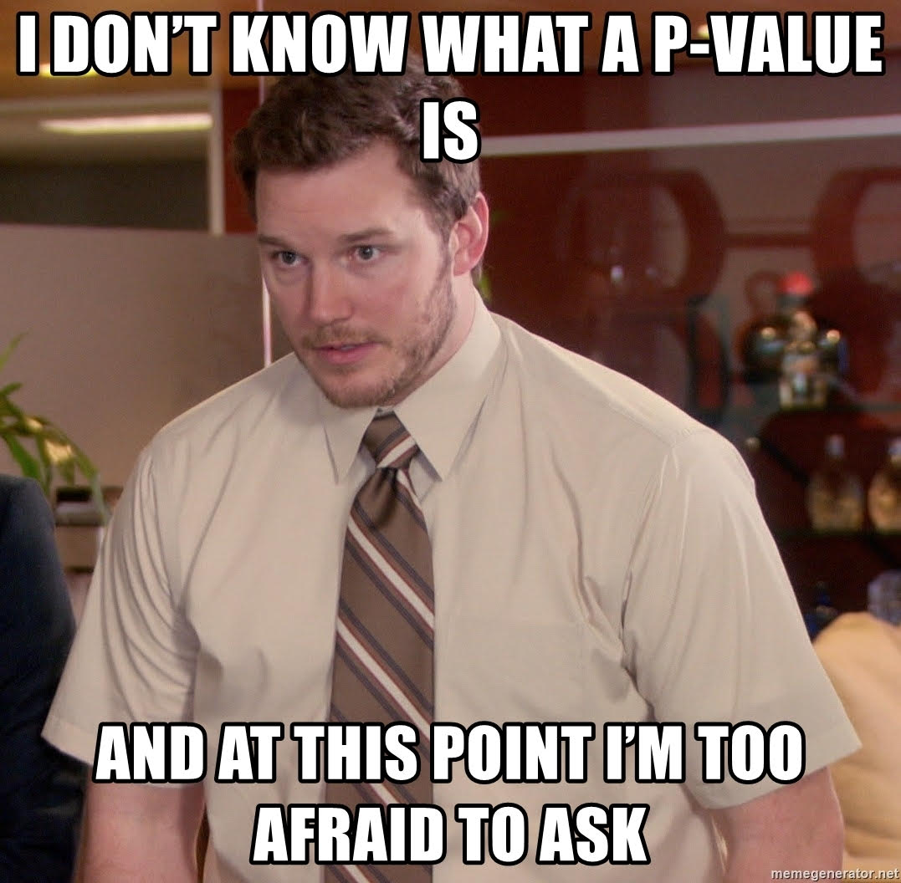



```{webr}
#| edit: false
#| output: false
#| autorun: true
quiet_library <- function(package) {
  suppressWarnings(suppressMessages(
    try(library(package, character.only = TRUE), silent = TRUE)
  ))
}

if (!exists("label", mode = "function")) {
  label <- function(x) {
    out <- attr(x, "label", exact = TRUE)
    if (is.null(out)) deparse(substitute(x)) else out
  }
}

if (!exists("var_label", mode = "function")) {
  var_label <- function(x) {
    out <- attr(x, "label", exact = TRUE)
    if (is.null(out)) deparse(substitute(x)) else out
  }
}

if (!exists("ggviolin", mode = "function")) {
  ggviolin <- function(data, x, y, fill = NULL, palette = NULL, add = NULL, add.params = list(), ...) {
    quiet_library("ggplot2")
    p <- ggplot2::ggplot(data, ggplot2::aes(x = .data[[x]], y = .data[[y]], fill = .data[[fill %||% x]])) +
      ggplot2::geom_violin(trim = FALSE, alpha = 0.7)
    if (!is.null(add) && "boxplot" %in% add) {
      p <- p + ggplot2::geom_boxplot(width = 0.12, fill = add.params$fill %||% "white", outlier.alpha = 0.35)
    }
    p
  }
}

if (!exists("ggpaired", mode = "function")) {
  ggpaired <- function(data, cond1, cond2, fill = NULL, line.color = "gray", line.size = 0.4, ...) {
    quiet_library("ggplot2")
    df <- data.frame(id = seq_len(nrow(data)), before = data[[cond1]], after = data[[cond2]])
    long <- rbind(
      data.frame(id = df$id, condition = cond1, value = df$before),
      data.frame(id = df$id, condition = cond2, value = df$after)
    )
    ggplot2::ggplot(long, ggplot2::aes(x = condition, y = value, group = id)) +
      ggplot2::geom_line(color = line.color, linewidth = line.size, alpha = 0.6) +
      ggplot2::geom_point(ggplot2::aes(fill = condition), shape = 21, size = 2)
  }
}

`%||%` <- function(x, y) if (is.null(x)) y else x

quiet_library("ggpubr")

Tennis3<-readRDS("tutorials/Lab11/www/Tennis3.Rda")
```

<div data-guided-lab data-lab-title="Lab 11"></div>

## Introduction

In this lab you learn how to implement a paired *t* test, and visualize paired data in R. 

## Paired *t* Tests

The paired t-test is a statistical procedure used to test whether the mean difference between two sets of observations is zero. In a paired t-test, each subject is measured twice, resulting in pairs of observations. The difference between paired samples is often referred too as delta ($\delta$) which in most cases is used to represent change. In our case we are interested to see if there was a significant change/difference in the mean difference between to matched populations. The null hypothesis is that the true mean difference is zero ($H_{0}:~\mu_{1}-\mu_{2}=0$). The two-sided alternative hypothesis assumes the mean difference is not equal to zero ($H_{A}:~\mu_{1}-\mu_{2}\neq 0$).  

Why do we use paired t tests? 

### Paired Samples

Before you use any statistical test you need to make sure you are using the right test for the data you have. The **paired *t* test** requires paired data. 

What is paired data? Paired data is defined as any circumstance in which each data point in one set of observations is **uniquely** matched to a data point in a second set of observations. Examples of studies that create paired data are pre/post samples in which variables are measured before and after an intervention. Cross over trials, and matched samples also create paired data. In all these cases there is a clear connect between unique pairs in the data. It is critical that you can identify the data type so that you do not use the wrong methods. The table below shows a very basic example of data from a paired design. The differences are calculated between pairs. The data we use is the difference column not data from sample 1 or sample 2 individually.

<style type="text/css">
.tg  {border-collapse:collapse;border-spacing:0;margin:0px auto;}
.tg td{font-family:Arial, sans-serif;font-size:14px;padding:10px 5px;border-style:solid;border-width:1px;overflow:hidden;word-break:normal;border-color:black;}
.tg th{font-family:Arial, sans-serif;font-size:14px;font-weight:normal;padding:10px 5px;border-style:solid;border-width:1px;overflow:hidden;word-break:normal;border-color:black;}
.tg .tg-0lax{text-align:left;vertical-align:top}
.tg .tg-ye28{background-color:#333333;color:#000000;text-align:left;vertical-align:top}
</style>
<table class="tg">
  <tr>
    <th class="tg-0lax">Pair</th>
    <th class="tg-0lax">Measure 1</th>
    <th class="tg-0lax">Measure 2</th>
    <th class="tg-0lax">Difference (delta)</th>
  </tr>
  <tr>
    <td class="tg-0lax">1</td>
    <td class="tg-0lax">4</td>
    <td class="tg-0lax">4</td>
    <td class="tg-0lax">0</td>
  </tr>
  <tr>
    <td class="tg-0lax">2</td>
    <td class="tg-0lax">5</td>
    <td class="tg-0lax">2</td>
    <td class="tg-0lax">3</td>
  </tr>
  <tr>
    <td class="tg-0lax">3</td>
    <td class="tg-0lax">2</td>
    <td class="tg-0lax">2</td>
    <td class="tg-0lax">0</td>
  </tr>
  <tr>
    <td class="tg-0lax">4</td>
    <td class="tg-0lax">7</td>
    <td class="tg-0lax">5</td>
    <td class="tg-0lax">2</td>
  </tr>
  <tr>
    <td class="tg-0lax">5</td>
    <td class="tg-0lax">2</td>
    <td class="tg-0lax">1</td>
    <td class="tg-0lax">1</td>
  </tr>
  <tr>
    <td class="tg-0lax">6</td>
    <td class="tg-0lax">1</td>
    <td class="tg-0lax">0</td>
    <td class="tg-0lax">1</td>
  </tr>
  <tr>
    <td class="tg-0lax">7</td>
    <td class="tg-0lax">5</td>
    <td class="tg-0lax">4</td>
    <td class="tg-0lax">1</td>
  </tr>
  <tr>
    <td class="tg-ye28"></td>
    <td class="tg-ye28"></td>
    <td class="tg-ye28"></td>
    <td class="tg-ye28"></td>
  </tr>
  <tr>
    <td class="tg-0lax"></td>
    <td class="tg-0lax">Measure 1 (Mean)</td>
    <td class="tg-0lax">Measure 2 (Mean)</td>
    <td class="tg-0lax">Mean Difference</td>
  </tr>
  <tr>
    <td class="tg-0lax"></td>
    <td class="tg-0lax">3.71</td>
    <td class="tg-0lax">2.57</td>
    <td class="tg-0lax">1.14</td>
  </tr>
</table> 

The exercises in this lab will use data from a cross over study. Read the description of how the data was collected and then complete the exercises. 

### Study Description

A crossover experiment was carried out to test the efficacy of Motrin for relieving pain due to tennis elbow.  82 volunteers in a sample were randomly assigned to two treatment groups.  Volunteers assigned to group 1 took Motrin for 3 weeks, followed by a 2-week washout period, and then took placebo for 3 weeks.  Volunteers assigned to group 2 took placebo for 3 weeks, followed by a 2-week washout period, and then took Motrin for 3 weeks.  Each volunteer was asked to fill out a questionnaire at three different times. First participants were asked to compare their pain level while they were playing tennis with their pain level at baseline.  Next participants were asked to compare their pain level 12 hours after they finished playing tennis to their baseline.  Finally, at the end of the treatment period the participants were asked about their overall impression on the drugs efficacy in reducing pain compared to baseline. The pain level was assessed using the following 6-point Likert scale. The values of the Likert scale correspond to the following changes from baseline pain: 1 = worse, 2 = unchanged, 3 = slightly improved (25%), 4 = moderately improved (50%), 5 = mostly improved (75%), 6 = completely improved (100%). 

### Exercise 1: Data and Assumption Check

**Data Dictionary**  
Age: Age of the participant in years      
Motrin1: Change in pain while playing tennis (Likert scale response while taking Motrin)  
Motrin2: Change in pain 12 hours after playing tennis (Likert scale response while taking Motrin)   
Motrin3: Over all change in pain at the end of the treatment period (Likert scale response after taking Motrin for 3 weeks)    
Placebo1: Change in pain while playing tennis (Likert scale response while taking placebo)  
Placebo2: Change in pain 12 hours after playing tennis (Likert scale response while taking placebo)  
Placebo3: Over all change in pain at the end of the treatment period (Likert scale response after taking placebo for 3 weeks)  
Delta1: Difference between Motrin and placebo while playing tennis (Motrin1 minus Placebo1)  
Delta2: Difference between Motrin and placebo 12 hours after playing tennis (Motrin2 minus Placebo2)  
Delta3: Difference between Motrin and placebo at the end of the treatment period (Motrin3 minus Placebo3)  

**Instructions** Review the data and variable distributions. Answer the quiz questions. 

```{=html}
<div class="lab-widget" data-tennis-summary data-csv="../tutorials/Lab11/www/Tennis3_clean.csv">
  <div class="lab-widget-controls">
    <label>Select Variable to Summarize
      <select data-tennis-variable>
        <option value="Age">Age</option>
        <option value="Motrin1">Motrin1</option>
        <option value="Motrin2">Motrin2</option>
        <option value="Motrin3">Motrin3</option>
        <option value="Placebo1">Placebo1</option>
        <option value="Placebo2">Placebo2</option>
        <option value="Placebo3">Placebo3</option>
        <option value="Delta1">Delta1</option>
        <option value="Delta2">Delta2</option>
        <option value="Delta3">Delta3</option>
      </select>
    </label>
  </div>
  <h4>Data</h4>
  <div class="lab-table-count" data-tennis-count></div>
  <div class="lab-table-wrap">
    <table class="lab-data-table">
      <thead></thead>
      <tbody></tbody>
    </table>
  </div>
  <div class="lab-split-widget">
    <div>
      <h4>Plot of Selected Variable</h4>
      <svg class="lab-plot" viewBox="0 0 760 420" role="img" aria-label="Plot of selected Tennis3 variable"></svg>
    </div>
    <div>
      <h4>Summary of Selected Variable</h4>
      <div class="lab-table-wrap lab-summary-table-wrap">
        <table class="lab-data-table" data-tennis-summary></table>
      </div>
    </div>
  </div>
</div>
```

### Quiz: Questions 1-3

<section class="lab-quiz" data-lab-quiz data-multi-quiz="true"><h4>Question 1</h4><p>Which variables need to have a normal distribution for the paired t test? (Select all that apply)</p><p class="quiz-note"> Select all correct answers.</p>
<div class="lab-answers"><button type="button" class="lab-answer" data-correct="false">Age</button>
<button type="button" class="lab-answer" data-correct="false">Motrin1</button>
<button type="button" class="lab-answer" data-correct="false">Motrin2</button>
<button type="button" class="lab-answer" data-correct="false">Motrin3</button>
<button type="button" class="lab-answer" data-correct="false">Placebo1</button>
<button type="button" class="lab-answer" data-correct="false">Placebo2</button>
<button type="button" class="lab-answer" data-correct="false">Placebo3</button>
<button type="button" class="lab-answer" data-correct="true">Delta1</button>
<button type="button" class="lab-answer" data-correct="true">Delta2</button>
<button type="button" class="lab-answer" data-correct="true">Delta3</button></div>
<button type="button" class="lab-check-answer" data-check-answers>Check Answers</button>
<div class="lab-feedback" aria-live="polite"></div></section>
<section class="lab-quiz" data-lab-quiz><h4>Question 2</h4><p>Since the data is not normal can we use the Central Limit Theorem?</p>
<div class="lab-answers"><button type="button" class="lab-answer" data-correct="true">Yes, our sample size is &gt; 40</button>
<button type="button" class="lab-answer" data-correct="false">No, we don&#x27;t meet the requirements of the CLT</button></div>
<div class="lab-feedback" aria-live="polite"></div></section>
<section class="lab-quiz" data-lab-quiz><h4>Question 3</h4><p>Does our data meet the simple random sample requirement?</p>
<div class="lab-answers"><button type="button" class="lab-answer" data-correct="true">Yes. It is a biologic process and the treatment is randomized</button>
<button type="button" class="lab-answer" data-correct="false">Yes. They are randomized</button>
<button type="button" class="lab-answer" data-correct="false">No. We shouldn&#x27;t do the test</button>
<button type="button" class="lab-answer" data-correct="false">You don&#x27;t need a random sample for the paired t test</button></div>
<div class="lab-feedback" aria-live="polite"></div></section>
### Exercise 2: Does Motrin reduce pain while playing tennis? 

Now that you have a feel for the data and have checked the assumptions for the paired *t* test we can start testing different hypotheses. We will use the same [t.test()](https://www.rdocumentation.org/packages/stats/versions/3.6.0/topics/t.test) function from lab 10. There are two ways to get the results of the paired *t* test using this function. If the differences have already be calculated then it follows the same form as the one sample *t* test  `t.test(delta, mu=#, alternative= type)`, where "delta" is the difference, "#" is the value of the null ($\mu_{0}=0$), and finally "type" which can be one of these three "two.sided", "less", or "greater". If you don't have the differences then this is the general form you will follow `t.test(data$x1, data$x2, paired=TRUE, alternative= type)`. You will give two variables to R, `data$x1` and `data$x2` which are the paired data to be compared (in our case, change in pain, Motrin vs Placebo). Setting "paired=TRUE" lets R know to take the difference between the two variables (TRUE has to be in all capital letters or it will not work). The "type" is the same as before (two sided, less than, greater than). You can use either of these two ways to test the hypothesis (**Note:** if you use the first way, the results will still be labeled as "one-sample", it is fine and if you think about it, you did only give it 1 sample).       

Perform a paired t-test of the null hypothesis that Motrin has no impact on pain during maximum activity (Motrin1 vs. Placebo1) against the two-sided alternative at the 0.05 significance level.

$$\alpha=0.05$$

$$H_{0}: \mu_{Motrin1}-\mu_{Placebo1}=0$$
$$H_{A}: \mu_{Motrin1}-\mu_{Placebo1}\neq0$$

**Instructions:** Complete the code below for both the ways to test the hypothesis and click the run code button. Use the output to answer the quiz questions. If you are having a hard time check out the example from STHDA [paired *t* tests in R](http://www.sthda.com/english/wiki/paired-samples-t-test-in-r)

```{webr}
#| edit: true
#| min-lines: 4
# We use the same t.test() function from lab 10
# Complete the code for both ways so you can 

t.test(Tennis3$Motrin1,Tennis3$Placebo1, paired = , alternative = "two.sided")

t.test(  , mu=0, alternative = "two.sided")
```
### Quiz: Questions 4-6

<section class="lab-quiz" data-lab-quiz><h4>Question 4</h4><p>What is the test statistic, degrees of freedom, and p-value of the test?</p>
<div class="lab-answers"><button type="button" class="lab-answer" data-correct="false">t = 12.101, df = 82, p-value = 1.253e-12</button>
<button type="button" class="lab-answer" data-correct="false">t = 9.1163, df = 81, p-value = 9.983e-04</button>
<button type="button" class="lab-answer" data-correct="true">t = 4.1061, df = 81, p-value = 9.551e-05</button>
<button type="button" class="lab-answer" data-correct="false">t = 2.6041, df = 83, p-value = 3.511e-05</button></div>
<div class="lab-feedback" aria-live="polite"></div></section>
<section class="lab-quiz" data-lab-quiz><h4>Question 5</h4><p>What is the 95% confidence interval for the mean difference between the treatment groups?</p>
<div class="lab-answers"><button type="button" class="lab-answer" data-correct="true">95% CI (0.4337173, 1.2492095)</button>
<button type="button" class="lab-answer" data-correct="false">95% CI (0.6237121, 1.9220692)</button>
<button type="button" class="lab-answer" data-correct="false">95% CI (0.3637334, 2.1492462)</button>
<button type="button" class="lab-answer" data-correct="false">95% CI (0.3433317, 1.4920852)</button></div>
<div class="lab-feedback" aria-live="polite"></div></section>
<section class="lab-quiz" data-lab-quiz><h4>Question 6</h4><p>Can you infer that Motrin causes a change in pain level while playing tennis?</p>
<div class="lab-answers"><button type="button" class="lab-answer" data-correct="true">Yes, the patients were randomized to treatment groups.</button>
<button type="button" class="lab-answer" data-correct="false">No, the sample was made up of volunteers</button>
<button type="button" class="lab-answer" data-correct="false">Yes, we used the right test</button>
<button type="button" class="lab-answer" data-correct="false">No, the sample was two small</button></div>
<div class="lab-feedback" aria-live="polite"></div></section>
### Exercise 3: Does Motrin reduce pain after playing tennis? 

Perform a paired t-test of the null hypothesis that Motrin has no impact on pain after playing tennis (Motrin2 vs. Placebo2) against the two-sided alternative at the 0.05 significance level.

$$\alpha=0.05$$

$$H_{0}: \mu_{Motrin}-\mu_{Placebo}=0$$
$$H_{A}: \mu_{Motrin}-\mu_{Placebo}\neq0$$

**Instructions:** Write the code to required to test the hypothesis and click the run code button. Use the output to answer the quiz questions. If you are having a hard time use the code above or check out the example from STHDA [paired *t* tests in R](http://www.sthda.com/english/wiki/paired-samples-t-test-in-r)

```{webr}
#| edit: true
#| min-lines: 4
# Write your code here. Used Motrin2 vs Placebo2, Or Delta2
```
### Quiz: Questions 7-9

<section class="lab-quiz" data-lab-quiz><h4>Question 7</h4><p>What is the test statistic, degrees of freedom, and p-value of the test?</p>
<div class="lab-answers"><button type="button" class="lab-answer" data-correct="false">t = 4.3157, df = 83, p-value = 0.1201424</button>
<button type="button" class="lab-answer" data-correct="true">t = 4.0417, df = 81, p-value = 0.0001201</button>
<button type="button" class="lab-answer" data-correct="false">t = 3.1954, df = 80, p-value = 0.3400242</button>
<button type="button" class="lab-answer" data-correct="false">t = 4.0417, df = 82, p-value = 0.5487313</button></div>
<div class="lab-feedback" aria-live="polite"></div></section>
<section class="lab-quiz" data-lab-quiz><h4>Question 8</h4><p>What is the 95% confidence interval for the mean difference between the treatment groups?</p>
<div class="lab-answers"><button type="button" class="lab-answer" data-correct="false">95% CI (0.3216711, 2.2334603)</button>
<button type="button" class="lab-answer" data-correct="false">95% CI (0.2210420, 1.2375043)</button>
<button type="button" class="lab-answer" data-correct="false">95% CI (0.4210623, 1.3245043)</button>
<button type="button" class="lab-answer" data-correct="true">95% CI (0.4210323, 1.2375043)</button></div>
<div class="lab-feedback" aria-live="polite"></div></section>
<section class="lab-quiz" data-lab-quiz><h4>Question 9</h4><p>Can you infer that Motrin causes a change in pain level after playing tennis?</p>
<div class="lab-answers"><button type="button" class="lab-answer" data-correct="false">No, the sample was made up of volunteers</button>
<button type="button" class="lab-answer" data-correct="false">Yes, we used the right test</button>
<button type="button" class="lab-answer" data-correct="true">Yes, the patients were randomized to treatment groups</button>
<button type="button" class="lab-answer" data-correct="false">No, the sample was two small</button></div>
<div class="lab-feedback" aria-live="polite"></div></section>
## Visualizing Paired Data

We will use a function called [ggpaired()](https://rpkgs.datanovia.com/ggpubr/reference/ggpaired.html) to visualize the over all change in pain at the end of treatment periods (Motrin3 vs Placebo3). Remember the higher the Likert scale score the greater the reduction in pain. 

### Exercise 4: Visualizing paired data

**Instructions:** The code below is complete, just click run code and use the plot to answer the quiz questions. 

```{webr}
#| edit: true
#| min-lines: 4
ggpaired(Tennis3, cond1="Placebo3", cond2 = "Motrin3", fill = "condition", line.color="gray", line.size = 0.4, palette = "npg")
```
**Explanation of Plot:** The plot shows the distribution of Likert scale values reported by patients at the end of three weeks of treatment with either placebo or Motrin. The lines show the change in the reported Likert scale values between pairs. If the line has a positive slope from placebo to Motrin that indicates the participant had a greater reduction in pain when on Motrin. A line with a negative slope from placebo to Motrin indicates the participant had a greater reduction in pain when on placebo. A line with no slope (aka flat) indicates no change in pain.  

### Quiz: Question 10

<section class="lab-quiz" data-lab-quiz><h4>Question 10</h4><p>Based on the plot did everyone report having less pain with Motrin compared to placebo?</p>
<div class="lab-answers"><button type="button" class="lab-answer" data-correct="false">Yes, all the participants had higher scores when on Motrin</button>
<button type="button" class="lab-answer" data-correct="true">No, some participants had higher scores when on placebo and others had no change</button>
<button type="button" class="lab-answer" data-correct="false">No, there are only 23 lines so not all the participants are shown</button>
<button type="button" class="lab-answer" data-correct="false">Yes, everyone knows Motrin reduces pain</button></div>
<div class="lab-feedback" aria-live="polite"></div></section>
## Summary

In this lab, you completed 4 exercises and answered 10 quiz questions. 

The lab covered 2 topics:

1. Paired *t* tests in R
2. Visualizing paired data in R

Great work you are done with lab! **Don't forget to record your answers and take the eLC quiz to get credit**  

If you have time here is another rabbit hole to explore. The placebo effect is real and if you want to know more about it a good place to start is the article in [The Scientist](https://www.the-scientist.com/research/the-biological-basis-of-the-placebo-effect-52396) magazine.

{.lab-summary-image}
