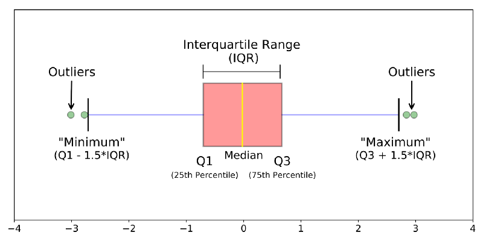
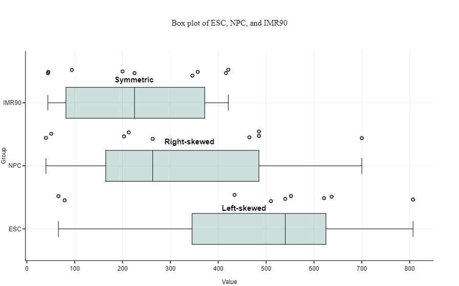
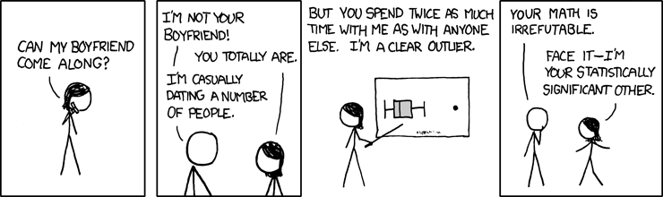



```{webr}
#| edit: false
#| output: false
#| autorun: true
quiet_library <- function(package) {
  suppressWarnings(suppressMessages(
    try(library(package, character.only = TRUE), silent = TRUE)
  ))
}

if (!exists("label", mode = "function")) {
  label <- function(x) {
    out <- attr(x, "label", exact = TRUE)
    if (is.null(out)) deparse(substitute(x)) else out
  }
}

if (!exists("var_label", mode = "function")) {
  var_label <- function(x) {
    out <- attr(x, "label", exact = TRUE)
    if (is.null(out)) deparse(substitute(x)) else out
  }
}

if (!exists("ggviolin", mode = "function")) {
  ggviolin <- function(data, x, y, fill = NULL, palette = NULL, add = NULL, add.params = list(), ...) {
    quiet_library("ggplot2")
    p <- ggplot2::ggplot(data, ggplot2::aes(x = .data[[x]], y = .data[[y]], fill = .data[[fill %||% x]])) +
      ggplot2::geom_violin(trim = FALSE, alpha = 0.7)
    if (!is.null(add) && "boxplot" %in% add) {
      p <- p + ggplot2::geom_boxplot(width = 0.12, fill = add.params$fill %||% "white", outlier.alpha = 0.35)
    }
    p
  }
}

if (!exists("ggpaired", mode = "function")) {
  ggpaired <- function(data, cond1, cond2, fill = NULL, line.color = "gray", line.size = 0.4, ...) {
    quiet_library("ggplot2")
    df <- data.frame(id = seq_len(nrow(data)), before = data[[cond1]], after = data[[cond2]])
    long <- rbind(
      data.frame(id = df$id, condition = cond1, value = df$before),
      data.frame(id = df$id, condition = cond2, value = df$after)
    )
    ggplot2::ggplot(long, ggplot2::aes(x = condition, y = value, group = id)) +
      ggplot2::geom_line(color = line.color, linewidth = line.size, alpha = 0.6) +
      ggplot2::geom_point(ggplot2::aes(fill = condition), shape = 21, size = 2)
  }
}

`%||%` <- function(x, y) if (is.null(x)) y else x

quiet_library("ggplot2")
quiet_library("labelled")

HeartFailure <- read.csv("tutorials/Lab3/www/heart.csv")

CleanHeartFailure<- readRDS("tutorials/Lab3/www/cleanheartfailure.Rda")
```

<div data-guided-lab data-lab-title="Lab 3"></div>

## Introduction

In this lab, you will learn how to create and interpret box plots. 

What is a Box plot? They are a visual representation of the minimum, Q1, median (Q2), Q3, and maximum values of a variable. Just like histograms, box plots should only be used with continuous or discrete variables. Box plots are similar to histograms in that they both display the distribution of a variable, but box plots make it to more straightforward to identify the actual value of the minimum, Q1, median (Q2), Q3, and maximum. Finding the actual value for a variable from a histogram is not possible because of the bins (think about it. if there are 12 observations in the 80-85 age interval there is no way to know if the specific max age only that it is some were between 80-85 years). 

### Making Box plots

You guessed it we are going to use R to make some basic box plots. We will use the boxplot() function check out [RDocumentation](https://www.rdocumentation.org/packages/graphics/versions/3.6.0/topics/boxplot) for more information. A box plot is constructed by drawing lines that correspond to the values of Q1 (the first quartile), the median (Q2), and Q3 (the third quartile) and then "boxing" in the median. Then "whiskers" are added that represents the min and max values in most cases, but if there are suspected outliers the whisker stops short, and the suspected outlier is represented by a dot or star. The definition R uses (and other stats software) for outliers is any observed value more than 1.5 times the IQR below Q1 or above Q3. So if your data has Q1=7 and Q3=10 the IQR=3 so any observations lower than 2.5 or higher than 14.5 would be a suspected outlier and represented by a dot or star.   

### Interpreting Box plots 

Several specific quantities are present visually. The image below shows you the parts different parts of the box plot.  


The skewness of the data can also be assessed with a box plot look at the example below. In this example the dots are not outliers, instead each dot represents the value for each observation. 


## Making and Interpreting Box Plots

To make a basic box plot, we will use the boxplot() function. The code to create a basic box plot is **boxplot(dataset\$variablename)** , so for example to make a box plot of age the code would be **boxplot(HeartFailure\$age)**.   

The data is the same as the previous labs. The data dictionary is also included.   

#### Data Dictionary
__age:__ age in years  
__sex:__ (1 = male; 0 = female)  
__trestbps:__ resting blood pressure (in mm Hg on admission to the hospital)  
__chol:__ serum cholesterol in mg/dl  
__fbs:__ (fasting blood sugar > 120 mg/dl) (1 = true; 0 = false)  
__thalach:__ maximum heart rate achieved  
__exang:__ exercise induced angina (1 = yes; 0 = no)  
__oldpeak:__ ST depression induced by exercise relative to rest  

```{webr}
#| edit: true
#| min-lines: 4
#show the last 10 observations in the dataset
tail(HeartFailure,10)
```
In the exercises below, you will make a box plot to answer the questions using R's boxplot() function. I made the first one for you, so all you have to do is run the code and use the box plot to answer the question. For the additional problems, all you need to do is copy and paste the code into the next code box, replace the variable name, and click the "Run Code". Use the box plots you create to answer the questions below.    

```{webr}
#| edit: true
#| min-lines: 4
# age is a continous/discrete variable so using a box plot is appropriate.
# adding "horizontal = TRUE" lets R know I want the box plot to be horizontal
# If you want to make the box plot vertical just delete ", horizontal = TRUE"
boxplot(HeartFailure$age, horizontal = TRUE)

# Use the summary() function to make it easier to get the exact values of the different parts of the box plot
summary(HeartFailure$age)
```
### Quiz: Questions 1-3
<section class="lab-quiz" data-lab-quiz><h4>Question 1</h4><p>Is the distribution of age skewed?</p>
<div class="lab-answers"><button type="button" class="lab-answer" data-correct="false" data-feedback="Try again.">Yes, to the left</button>
<button type="button" class="lab-answer" data-correct="true" data-feedback="Correct.">No, seems pretty centered</button>
<button type="button" class="lab-answer" data-correct="false" data-feedback="Try again.">Yes, to the right</button></div>
<div class="lab-feedback" aria-live="polite"></div></section>
<section class="lab-quiz" data-lab-quiz><h4>Question 2</h4><p>What is the median age?</p>
<div class="lab-answers"><button type="button" class="lab-answer" data-correct="true" data-feedback="Correct.">55</button>
<button type="button" class="lab-answer" data-correct="false" data-feedback="Try again.">54.37</button>
<button type="button" class="lab-answer" data-correct="false" data-feedback="Try again.">47.5</button>
<button type="button" class="lab-answer" data-correct="false" data-feedback="Try again.">56</button></div>
<div class="lab-feedback" aria-live="polite"></div></section>
<section class="lab-quiz" data-lab-quiz><h4>Question 3</h4><p>What is the IQR for age?</p>
<div class="lab-answers"><button type="button" class="lab-answer" data-correct="false" data-feedback="Try again.">29</button>
<button type="button" class="lab-answer" data-correct="false" data-feedback="Try again.">61</button>
<button type="button" class="lab-answer" data-correct="false" data-feedback="Try again.">47.5</button>
<button type="button" class="lab-answer" data-correct="true" data-feedback="Correct.">13.5</button></div>
<div class="lab-feedback" aria-live="polite"></div></section>
```{webr}
#| edit: true
#| min-lines: 4
# make a box plot for chol.
```
### Quiz: Questions 4-6
<section class="lab-quiz" data-lab-quiz><h4>Question 4</h4><p>Are there outliers in the cholesterol variable?</p>
<div class="lab-answers"><button type="button" class="lab-answer" data-correct="false" data-feedback="Try again.">Yes, to the left</button>
<button type="button" class="lab-answer" data-correct="false" data-feedback="Try again.">No</button>
<button type="button" class="lab-answer" data-correct="true" data-feedback="Correct.">Yes, to the right</button></div>
<div class="lab-feedback" aria-live="polite"></div></section>
<section class="lab-quiz" data-lab-quiz><h4>Question 5</h4><p>What is the highest non-outlier value for cholesterol?</p>
<div class="lab-answers"><button type="button" class="lab-answer" data-correct="true" data-feedback="Correct.">Around 350</button>
<button type="button" class="lab-answer" data-correct="false" data-feedback="Try again.">Around 290</button>
<button type="button" class="lab-answer" data-correct="false" data-feedback="Try again.">Around 550</button>
<button type="button" class="lab-answer" data-correct="false" data-feedback="Try again.">There are no outliers</button></div>
<div class="lab-feedback" aria-live="polite"></div></section>
<section class="lab-quiz" data-lab-quiz><h4>Question 6</h4><p>What is the IQR for cholesterol?</p>
<div class="lab-answers"><button type="button" class="lab-answer" data-correct="false" data-feedback="Try again.">438</button>
<button type="button" class="lab-answer" data-correct="false" data-feedback="Try again.">-63.5</button>
<button type="button" class="lab-answer" data-correct="false" data-feedback="Try again.">126</button>
<button type="button" class="lab-answer" data-correct="true" data-feedback="Correct.">63.5</button></div>
<div class="lab-feedback" aria-live="polite"></div></section>
```{webr}
#| edit: true
#| min-lines: 4
# make a box plot for trestbps. Use the summary function so you can get the exact value
```
### Quiz: Questions 7-9
<section class="lab-quiz" data-lab-quiz><h4>Question 7</h4><p>What is the range for trestbps?</p>
<div class="lab-answers"><button type="button" class="lab-answer" data-correct="false" data-feedback="Try again.">120</button>
<button type="button" class="lab-answer" data-correct="true" data-feedback="Correct.">106</button>
<button type="button" class="lab-answer" data-correct="false" data-feedback="Try again.">20</button>
<button type="button" class="lab-answer" data-correct="false" data-feedback="Try again.">76</button></div>
<div class="lab-feedback" aria-live="polite"></div></section>
<section class="lab-quiz" data-lab-quiz><h4>Question 8</h4><p>Is the distribution of trestbps skewed?</p>
<div class="lab-answers"><button type="button" class="lab-answer" data-correct="false" data-feedback="Try again.">Yes, to the left</button>
<button type="button" class="lab-answer" data-correct="false" data-feedback="Try again.">No</button>
<button type="button" class="lab-answer" data-correct="true" data-feedback="Correct.">Yes, to the right</button></div>
<div class="lab-feedback" aria-live="polite"></div></section>
<section class="lab-quiz" data-lab-quiz><h4>Question 9</h4><p>What is the IQR for trestbps?</p>
<div class="lab-answers"><button type="button" class="lab-answer" data-correct="true" data-feedback="Correct.">20</button>
<button type="button" class="lab-answer" data-correct="false" data-feedback="Try again.">26</button>
<button type="button" class="lab-answer" data-correct="false" data-feedback="Try again.">60</button>
<button type="button" class="lab-answer" data-correct="false" data-feedback="Try again.">8.4</button></div>
<div class="lab-feedback" aria-live="polite"></div></section>
```{webr}
#| edit: true
#| min-lines: 4
# make a box plot for oldpeak.
```
### Quiz: Questions 10-12
<section class="lab-quiz" data-lab-quiz><h4>Question 10</h4><p>Is the distribution of oldpeak skewed?</p>
<div class="lab-answers"><button type="button" class="lab-answer" data-correct="false" data-feedback="Try again.">Yes, to the left</button>
<button type="button" class="lab-answer" data-correct="false" data-feedback="Try again.">No, the median seems pretty centered</button>
<button type="button" class="lab-answer" data-correct="true" data-feedback="Correct.">Yes, to the right</button></div>
<div class="lab-feedback" aria-live="polite"></div></section>
<section class="lab-quiz" data-lab-quiz><h4>Question 11</h4><p>What is the median for oldpeak?</p>
<div class="lab-answers"><button type="button" class="lab-answer" data-correct="false" data-feedback="Try again.">1.60</button>
<button type="button" class="lab-answer" data-correct="false" data-feedback="Try again.">0</button>
<button type="button" class="lab-answer" data-correct="false" data-feedback="Try again.">1.04</button>
<button type="button" class="lab-answer" data-correct="true" data-feedback="Correct.">0.8</button></div>
<div class="lab-feedback" aria-live="polite"></div></section>
<section class="lab-quiz" data-lab-quiz><h4>Question 12</h4><p>What is the IQR of oldpeak?</p>
<div class="lab-answers"><button type="button" class="lab-answer" data-correct="false" data-feedback="Try again.">2</button>
<button type="button" class="lab-answer" data-correct="true" data-feedback="Correct.">1.60</button>
<button type="button" class="lab-answer" data-correct="false" data-feedback="Try again.">0</button>
<button type="button" class="lab-answer" data-correct="false" data-feedback="Try again.">0.24</button></div>
<div class="lab-feedback" aria-live="polite"></div></section>
## Comparing Groups with Box Plots

Box plots are also very useful to make comparisons between groups. The first step is to stratify (fancy word for divide) the data based on the value of a variable. A box plot is created for each stratum, and they are plotted next to each so you can quickly compare them. In our case, we have three categorical variables that we will use to stratify our data. See if you can find any variables that have major difference between groups.   

**Instructions** Use the dropdown menu to select different variables to compare by different strata. Use the plot to answer the quiz questions.   

```{=html}
<div class="lab-widget lab-boxplot-widget" data-heart-boxplot data-csv="../tutorials/Lab3/www/heart.csv">
  <div class="lab-widget-controls">
    <label>
      <span>Compare By</span>
      <select data-heart-boxplot-group>
        <option value="sex">sex</option>
        <option value="fbs">fbs</option>
        <option value="exang">exang</option>
      </select>
    </label>
    <label>
      <span>Variable</span>
      <select data-heart-boxplot-variable>
        <option value="age">age</option>
        <option value="chol">chol</option>
        <option value="trestbps">trestbps</option>
        <option value="thalach">thalach</option>
        <option value="oldpeak">oldpeak</option>
      </select>
    </label>
  </div>
  <svg class="lab-plot" viewBox="0 0 760 380" role="img" aria-label="Grouped box plot for selected heart failure variable"></svg>
</div>
```

### Quiz: Questions 13-14
<section class="lab-quiz" data-lab-quiz><h4>Question 13</h4><p>Does cholesterol seem to be different for males and females?</p>
<div class="lab-answers"><button type="button" class="lab-answer" data-correct="true" data-feedback="Correct.">Yes, the median and IQR for females is higher</button>
<button type="button" class="lab-answer" data-correct="false" data-feedback="Try again.">No, they might as well be the same boxplot</button>
<button type="button" class="lab-answer" data-correct="false" data-feedback="Try again.">No, the difference is not statistically significant</button>
<button type="button" class="lab-answer" data-correct="false" data-feedback="Try again.">Yes, the difference is statistically significant</button></div>
<div class="lab-feedback" aria-live="polite"></div></section>
<section class="lab-quiz" data-lab-quiz><h4>Question 14</h4><p>Is there any difference in resting blood pressure for patients based on fbs?</p>
<div class="lab-answers"><button type="button" class="lab-answer" data-correct="false" data-feedback="Try again.">No, the difference is not statistically significant</button>
<button type="button" class="lab-answer" data-correct="false" data-feedback="Try again.">No, the medians are almost exactly the same</button>
<button type="button" class="lab-answer" data-correct="false" data-feedback="Try again.">Yes, the difference is statistically significant</button>
<button type="button" class="lab-answer" data-correct="true" data-feedback="Correct.">Yes, the median, Q1, and Q3 are higher for the Yes group</button></div>
<div class="lab-feedback" aria-live="polite"></div></section>
## Summary 

In this lab, You completed 5 exercises and answered 14 quiz questions. 

1. You learned how to make and interpret a box plot 

2. You used box plots to see if there were any differences between different strata  

Great job! You are done with the lab! **Don't forget to record your answers and take the eLC quiz so you get credit**  


