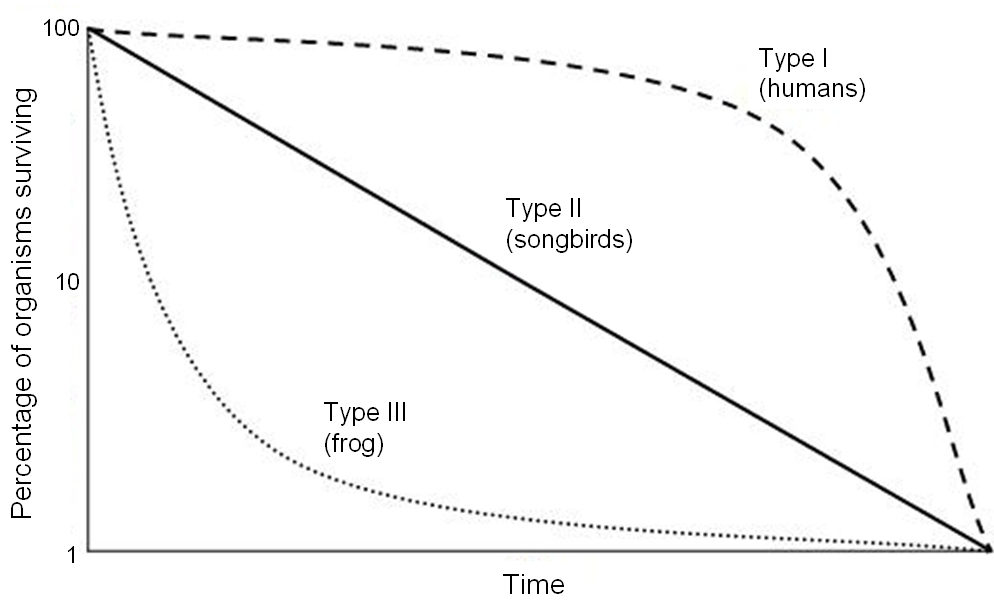
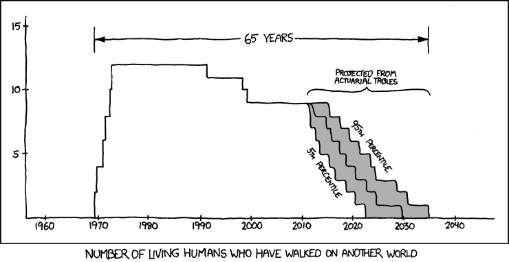



```{webr}
#| edit: false
#| output: false
#| autorun: true
quiet_library <- function(package) {
  suppressWarnings(suppressMessages(
    try(library(package, character.only = TRUE), silent = TRUE)
  ))
}

if (!exists("label", mode = "function")) {
  label <- function(x) {
    out <- attr(x, "label", exact = TRUE)
    if (is.null(out)) deparse(substitute(x)) else out
  }
}

if (!exists("var_label", mode = "function")) {
  var_label <- function(x) {
    out <- attr(x, "label", exact = TRUE)
    if (is.null(out)) deparse(substitute(x)) else out
  }
}

if (!exists("ggviolin", mode = "function")) {
  ggviolin <- function(data, x, y, fill = NULL, palette = NULL, add = NULL, add.params = list(), ...) {
    quiet_library("ggplot2")
    p <- ggplot2::ggplot(data, ggplot2::aes(x = .data[[x]], y = .data[[y]], fill = .data[[fill %||% x]])) +
      ggplot2::geom_violin(trim = FALSE, alpha = 0.7)
    if (!is.null(add) && "boxplot" %in% add) {
      p <- p + ggplot2::geom_boxplot(width = 0.12, fill = add.params$fill %||% "white", outlier.alpha = 0.35)
    }
    p
  }
}

if (!exists("ggpaired", mode = "function")) {
  ggpaired <- function(data, cond1, cond2, fill = NULL, line.color = "gray", line.size = 0.4, ...) {
    quiet_library("ggplot2")
    df <- data.frame(id = seq_len(nrow(data)), before = data[[cond1]], after = data[[cond2]])
    long <- rbind(
      data.frame(id = df$id, condition = cond1, value = df$before),
      data.frame(id = df$id, condition = cond2, value = df$after)
    )
    ggplot2::ggplot(long, ggplot2::aes(x = condition, y = value, group = id)) +
      ggplot2::geom_line(color = line.color, linewidth = line.size, alpha = 0.6) +
      ggplot2::geom_point(ggplot2::aes(fill = condition), shape = 21, size = 2)
  }
}

`%||%` <- function(x, y) if (is.null(x)) y else x

quiet_library("ggplot2")
quiet_library("dplyr")
quiet_library("tidyr")

lifeEx1<- read.csv("tutorials/Lab5/www/lifeexpectancy1900to2016sex.csv")

survTY<- readRDS("tutorials/Lab5/www/survTY.Rda")
```

<div data-guided-lab data-lab-title="Lab 5"></div>

## Introduction 
In this lab, you will work with data from life tables. 

You will learn what life tables are used for, how to visualize the data from life tables, and how to calculate values in the table.  

## Life Expectancy

Life tables are used to calculate life expectancy for a population. Life expectancy at birth is one statistic you commonly hear reported in the news. The CDC releases a yearly report for the US population and for two years in a row life expectancy in the US has decreased [Read the report](https://www.cdc.gov/nchs/data/nvsr/nvsr67/nvsr67_07-508.pdf). The at least some of the decrease in life expectancy has been attributed to preventable causes like drug overdose. The good news is that if the decrease is due to preventable cause we can do something about it. 

Most people don't really understand what life expectancy a birth is. Life expectancy at birth is defined as how long, on average, a newborn can expect to live, if current death rates do not change. The second part is a pretty strong assumption. It is unlikely that the same mortality patterns for ages 1-100+ stay the same through out the whole life of a new born. Mortality patterns are not static so the actual life expectancy maybe more or less. The "true" life expectancy of a new born can only be calculated once everyone born that year have died, but that measure is not really used for public health since it is not helpful. The best way to interpret life expectancy at birth is that if nothing changes (in med)  

Life expectancy is used as a marker of a populations total health, and is often used to compare the health in different nations. Increases in life expectancy are generally related increases in sanitation (think clean drinking water), improvements in standard of living (better housing, access to food), access to medical care, and breakthroughs in medical science or quitting harmful behaviors (like smoking in the US). Check out [Our World in Data](https://ourworldindata.org/life-expectancy) and you can see life expediencies for countries across the globe from 1543 to 2015. 

### Exercise 1 
**Instructions:** Play around with the interactive plot. You can see the change in life expectancy over a range years for everyone and you can also stratified by sex. Use the plot below to answer quiz questions 1-3 (**set the year range to 1900 and 2015 to answer the questions** ). 

```{=html}
<div class="lab-widget lab-line-widget" data-life-expectancy data-csv="../tutorials/Lab5/www/lifeexpectancy1900to2016sex.csv">
  <div class="lab-widget-controls">
    <label>
      <span>Start Year</span>
      <input type="range" min="1900" max="2015" value="1950" data-life-start>
      <output data-life-start-value>1950</output>
    </label>
    <label>
      <span>End Year</span>
      <input type="range" min="1900" max="2015" value="2000" data-life-end>
      <output data-life-end-value>2000</output>
    </label>
    <label class="lab-check"><input type="checkbox" value="Males" data-life-series checked> Males</label>
    <label class="lab-check"><input type="checkbox" value="Females" data-life-series checked> Females</label>
    <label class="lab-check"><input type="checkbox" value="Everyone" data-life-series checked> Everyone</label>
  </div>
  <svg class="lab-plot" viewBox="0 0 760 420" role="img" aria-label="Life expectancy at birth over time"></svg>
</div>
```

### Quiz: Questions 1-3

<section class="lab-quiz" data-lab-quiz><h4>Question 1</h4><p>What do you think caused the major dip in life expectancy between 1919-1924?</p>
<div class="lab-answers"><button type="button" class="lab-answer" data-correct="false" data-feedback="America was only involved for the last part">World War 1</button>
<button type="button" class="lab-answer" data-correct="false" data-feedback="Thankfully that has never been a major problem in America">Bubonic Plague</button>
<button type="button" class="lab-answer" data-correct="true" data-feedback="The 1918 Flu pandemic was a big deal.">Influenza</button>
<button type="button" class="lab-answer" data-correct="false" data-feedback="Thankfully america has not experienced a famine in recent history.">Famine</button></div>
<div class="lab-feedback" aria-live="polite"></div></section>
<section class="lab-quiz" data-lab-quiz><h4>Question 2</h4><p>Why do you think the lines smooth out and increase after 1950?</p>
<div class="lab-answers"><button type="button" class="lab-answer" data-correct="true" data-feedback="The student has become the master!">Antibiotics, Vaccines, and Increased Standard of Living</button>
<button type="button" class="lab-answer" data-correct="false" data-feedback="Try again.">More and Better Doctors</button>
<button type="button" class="lab-answer" data-correct="false" data-feedback="Try again.">More accurate data collection</button>
<button type="button" class="lab-answer" data-correct="false" data-feedback="Try again.">The positive influence of Leave it to Beaver</button></div>
<div class="lab-feedback" aria-live="polite"></div></section>
<section class="lab-quiz" data-lab-quiz><h4>Question 3</h4><p>During which years was life expectancy for males and females the most similar?</p>
<div class="lab-answers"><button type="button" class="lab-answer" data-correct="false" data-feedback="Make sure you have the year range set correctly">2004-2012</button>
<button type="button" class="lab-answer" data-correct="false" data-feedback="The lines are not as close as other years">1900-1908</button>
<button type="button" class="lab-answer" data-correct="false" data-feedback="The lines are not as close as other years">1940-1948</button>
<button type="button" class="lab-answer" data-correct="true" data-feedback="The lines are almost on top of each other. Can you think of a reason why?">1916-1924</button></div>
<div class="lab-feedback" aria-live="polite"></div></section>
## Survival Curves

Another common representation of life table data is the survival curve or survivor-ship which is what the CDC calls it. These curves show the proportion of individuals who survived to each age group. The graph below represents three general survival curves. The type one curve is typical of humans who have only a few offspring and invest a lot of effort keeping them alive. The type 2 curve is a diagonal which means that mortality rate is more or less constant regardless of the age. The third type is concave this indicates that the greatest risk of mortality is early in life. Sea turtles, amphibians, and other animals who have huge number of offspring often have survival curves with this shape.  


### Exercise 2

**Instructions:** Play around with the interactive plot. You can see the change in survival for different decades and you can also stratified by sex and race. If you select more than 6 strata the 7th one will not be displayed. Use the plot to answer quiz questions 4-6. 

```{=html}
<div class="lab-widget lab-line-widget" data-life-table-curve data-csv="../tutorials/Lab5/www/survTY.csv" data-y-column="SurvivalP" data-y-title="Proportion Surviving" data-title="Survival Curves for Selected Years and Strata">
  <div class="lab-widget-controls" data-life-table-controls></div>
  <svg class="lab-plot" viewBox="0 0 760 440" role="img" aria-label="Survival curves for selected years and groups"></svg>
</div>
```

### Quiz: Questions 4-6
<section class="lab-quiz" data-lab-quiz><h4>Question 4</h4><p>(Select: All, 2015, and 1900) The survival curve for 1900 looks like the most like which of the general curve types?</p>
<div class="lab-answers"><button type="button" class="lab-answer" data-correct="false" data-feedback="Make sure you are looking at the 1900 curve not the on for 2015">Type 1</button>
<button type="button" class="lab-answer" data-correct="true" data-feedback="Exactly, we were barely doing better than the birds!">Type 2</button>
<button type="button" class="lab-answer" data-correct="false" data-feedback="That would be terrible, so I am glad you are not right">Type 3</button></div>
<div class="lab-feedback" aria-live="polite"></div></section>
<section class="lab-quiz" data-lab-quiz><h4>Question 5</h4><p>(Select: All Male, All Female, and 2015) What age range does survival for men and women begin to differ for 2015?</p>
<div class="lab-answers"><button type="button" class="lab-answer" data-correct="true" data-feedback="Nailed it! Any idea why?">20-30</button>
<button type="button" class="lab-answer" data-correct="false" data-feedback="They are different but the curves start to separate earlier">60-75</button>
<button type="button" class="lab-answer" data-correct="false" data-feedback="They are different but the curves start to separate earlier">75-90</button>
<button type="button" class="lab-answer" data-correct="false" data-feedback="They are different but the curves start to separate earlier">40-55</button></div>
<div class="lab-feedback" aria-live="polite"></div></section>
<section class="lab-quiz" data-lab-quiz><h4>Question 6</h4><p>(Select: All, and all the years) In which decades did survival for those 50 years old seem to increase the most?</p>
<div class="lab-answers"><button type="button" class="lab-answer" data-correct="true" data-feedback="You got it!">1930-1950</button>
<button type="button" class="lab-answer" data-correct="false" data-feedback="There was an improvement but it is smaller than other decades.">1900-1910</button>
<button type="button" class="lab-answer" data-correct="false" data-feedback="There was very little change for people 50 years old during this time.">1990-2010</button>
<button type="button" class="lab-answer" data-correct="false" data-feedback="There was very little change for people 50 years old during this time.">1910-1920</button></div>
<div class="lab-feedback" aria-live="polite"></div></section>
## Hazard Function

In the previous topic we look at the proportion of people surviving. If instead we look at the proportion of people dying we call it a hazard function. The simple definition of the hazard function is a method to estimate a persons chance or probability of death at a given age. More specifically, the hazard function allows us to visualize which ages have the highest or lowest probability of death.

### Exercise 3

**Instructions:** Play around with the interactive plot. You can see the change in the mortality hazard for different decades and you can also stratified by sex and race. If you select more than 6 strata the 7th one will not be displayed. Use the plot to answer quiz questions 7-10. 

```{=html}
<div class="lab-widget lab-line-widget" data-life-table-curve data-csv="../tutorials/Lab5/www/survTY.csv" data-y-column="qx" data-y-title="Proportion Dying" data-title="Hazard for Selected Years and Strata">
  <div class="lab-widget-controls" data-life-table-controls></div>
  <svg class="lab-plot" viewBox="0 0 760 440" role="img" aria-label="Mortality hazard curves for selected years and groups"></svg>
</div>
```

### Quiz: Questions 7-10
<section class="lab-quiz" data-lab-quiz><h4>Question 7</h4><p>(Select: All and 1900) What ages are the mortality hazards the highest?</p>
<div class="lab-answers"><button type="button" class="lab-answer" data-correct="true" data-feedback="Thank goodness we live in the time of modern medicine">0-1 and 55+</button>
<button type="button" class="lab-answer" data-correct="false" data-feedback="Make sure you made the right selections. This is actually the time with the lowest mortality hazard">5-40</button>
<button type="button" class="lab-answer" data-correct="false" data-feedback="Don&#x27;t forget about the hazard early in life">60+</button>
<button type="button" class="lab-answer" data-correct="false" data-feedback="Make sure you made the right selections.">10+</button></div>
<div class="lab-feedback" aria-live="polite"></div></section>
<section class="lab-quiz" data-lab-quiz><h4>Question 8</h4><p>(Select: All, 2015, and 1900) Which ages have had the smallest change in their mortality hazard?</p>
<div class="lab-answers"><button type="button" class="lab-answer" data-correct="false" data-feedback="Make sure you have the right years selected. We have made great strides in early child hood mortality since 1900">0-5</button>
<button type="button" class="lab-answer" data-correct="true" data-feedback="The next question would be why?">5-15</button>
<button type="button" class="lab-answer" data-correct="false" data-feedback="Make sure you have the right years selected.">65-75</button>
<button type="button" class="lab-answer" data-correct="false" data-feedback="Make sure you have the right years selected. They are close but other ages are much closer">45-55</button></div>
<div class="lab-feedback" aria-live="polite"></div></section>
<section class="lab-quiz" data-lab-quiz><h4>Question 9</h4><p>(Select: All, and all the years) Which age has consistently had the lowest mortality hazard?</p>
<div class="lab-answers"><button type="button" class="lab-answer" data-correct="false" data-feedback="This has generally been one of the more risky times in life!">1</button>
<button type="button" class="lab-answer" data-correct="false" data-feedback="There was an improvement but it is smaller than other decades.">35</button>
<button type="button" class="lab-answer" data-correct="true" data-feedback="I wonder why?">10</button>
<button type="button" class="lab-answer" data-correct="false" data-feedback="There was very little change for children 5 years old but there is another age with even less change.">5</button></div>
<div class="lab-feedback" aria-live="polite"></div></section>
<section class="lab-quiz" data-lab-quiz><h4>Question 10</h4><p>(Select: White All, African American All, and, 2015) After 60 years at what age do the lines cross?</p>
<div class="lab-answers"><button type="button" class="lab-answer" data-correct="false" data-feedback="Make sure you made the right selections">80</button>
<button type="button" class="lab-answer" data-correct="false" data-feedback="Actually these dots will always be the same. Only because data is only reported as 100+ since it would be to easy to identify people.">100</button>
<button type="button" class="lab-answer" data-correct="false" data-feedback="Make sure you made the right selections">90</button>
<button type="button" class="lab-answer" data-correct="true" data-feedback="Excellent work interpreting the data!">85</button></div>
<div class="lab-feedback" aria-live="polite"></div></section>
## Summary 

In this lab, you completed 3 exercises and answered 10 quiz questions. 

The lab covered 3 topics:

1. Life expectancy at birth 
2. Survival curves 
3. Hazard curves

Give yourself a high five! You are done with the lab. **Don't forget to record your answers and take the eLC quiz to get credit** 


