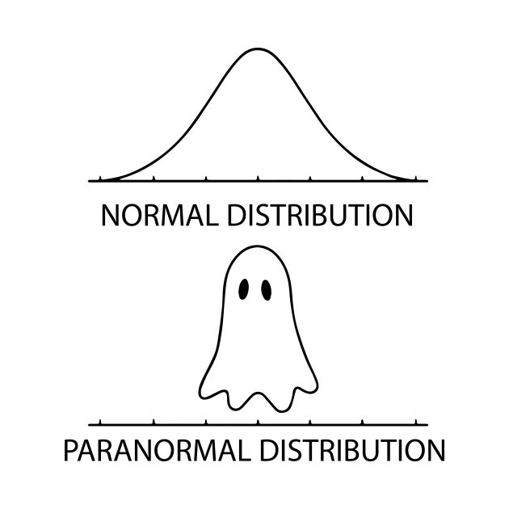



```{webr}
#| edit: false
#| output: false
#| autorun: true
quiet_library <- function(package) {
  suppressWarnings(suppressMessages(
    try(library(package, character.only = TRUE), silent = TRUE)
  ))
}

if (!exists("label", mode = "function")) {
  label <- function(x) {
    out <- attr(x, "label", exact = TRUE)
    if (is.null(out)) deparse(substitute(x)) else out
  }
}

if (!exists("var_label", mode = "function")) {
  var_label <- function(x) {
    out <- attr(x, "label", exact = TRUE)
    if (is.null(out)) deparse(substitute(x)) else out
  }
}

if (!exists("ggviolin", mode = "function")) {
  ggviolin <- function(data, x, y, fill = NULL, palette = NULL, add = NULL, add.params = list(), ...) {
    quiet_library("ggplot2")
    p <- ggplot2::ggplot(data, ggplot2::aes(x = .data[[x]], y = .data[[y]], fill = .data[[fill %||% x]])) +
      ggplot2::geom_violin(trim = FALSE, alpha = 0.7)
    if (!is.null(add) && "boxplot" %in% add) {
      p <- p + ggplot2::geom_boxplot(width = 0.12, fill = add.params$fill %||% "white", outlier.alpha = 0.35)
    }
    p
  }
}

if (!exists("ggpaired", mode = "function")) {
  ggpaired <- function(data, cond1, cond2, fill = NULL, line.color = "gray", line.size = 0.4, ...) {
    quiet_library("ggplot2")
    df <- data.frame(id = seq_len(nrow(data)), before = data[[cond1]], after = data[[cond2]])
    long <- rbind(
      data.frame(id = df$id, condition = cond1, value = df$before),
      data.frame(id = df$id, condition = cond2, value = df$after)
    )
    ggplot2::ggplot(long, ggplot2::aes(x = condition, y = value, group = id)) +
      ggplot2::geom_line(color = line.color, linewidth = line.size, alpha = 0.6) +
      ggplot2::geom_point(ggplot2::aes(fill = condition), shape = 21, size = 2)
  }
}

`%||%` <- function(x, y) if (is.null(x)) y else x

quiet_library("ggplot2")
```

<div data-guided-lab data-lab-title="Lab 8"></div>

::: {.callout-tip}
Run the R code cells directly in your browser. Use the quiz buttons for immediate feedback, then record your answers in eLC.
:::

## Introduction

In this lab you will explore the normal distribution. 

## Normal distribution

The normal distribution is used to describe continuous data. It is a two parameter distribution defined by the mean ($\mu$) and standard deviation ($\sigma$). Every aspect of the curve is described using the following notation ($N(\mu,~\sigma)$) where the mean ($\mu$) can be any real number and the standard deviation ($\sigma$) any value greater then 0. In the exercise you will get to see the impact the mean and standard deviation have on the shape of the distribution curve. Also unlike the last lab the normal distribution is visualized with a line instead of vertical lines. This is because unlike the discrete distributions values between the integers are possible. 

### Exercise 1: Visualizing the normal distribution

**Instructions** The plot below shows three normal curves. Use the sliders to change the means and standard deviations to see the impact it has on the shape and position of the curve. Once you get a feel for whats happening, use the interactive plot to answer the quiz question. (You will have to adjust the X axis range if the mean is set far away from 0)

```{=html}
<div class="lab-widget lab-normal-curves-widget" data-normal-curves>
  <div class="lab-normal-panel-grid">
    <section class="lab-normal-panel">
      <h4>Parameters for The <span class="lab-normal-green">Green</span> Distribution</h4>
      <label><span>Green Mean:</span><output data-normal-mean-output="green">0</output><input type="range" min="-100" max="100" value="0" step="0.5" data-normal-mean="green"></label>
      <label><span>Green Standard Deviation:</span><output data-normal-sd-output="green">1</output><input type="range" min="0.5" max="20" value="1" step="0.5" data-normal-sd="green"></label>
    </section>
    <section class="lab-normal-panel">
      <h4>Parameters for The <span class="lab-normal-blue">Blue</span> Distribution</h4>
      <label><span>Blue Mean:</span><output data-normal-mean-output="blue">0</output><input type="range" min="-100" max="100" value="0" step="0.5" data-normal-mean="blue"></label>
      <label><span>Blue Standard Deviation:</span><output data-normal-sd-output="blue">3</output><input type="range" min="0.5" max="20" value="3" step="0.5" data-normal-sd="blue"></label>
    </section>
    <section class="lab-normal-panel">
      <h4>Parameters for The <span class="lab-normal-red">Red</span> Distribution</h4>
      <label><span>Red Mean:</span><output data-normal-mean-output="red">0</output><input type="range" min="-100" max="100" value="0" step="0.5" data-normal-mean="red"></label>
      <label><span>Red Standard Deviation:</span><output data-normal-sd-output="red">5</output><input type="range" min="0.5" max="20" value="5" step="0.5" data-normal-sd="red"></label>
    </section>
  </div>
  <section class="lab-normal-panel lab-normal-axis-panel">
    <h4>Set limits of X axis:</h4>
    <div class="lab-normal-axis-controls">
      <label><span>Minimum</span><output data-normal-x-min-output>-15</output><input type="range" min="-175" max="175" value="-15" step="1" data-normal-x-min></label>
      <label><span>Maximum</span><output data-normal-x-max-output>15</output><input type="range" min="-175" max="175" value="15" step="1" data-normal-x-max></label>
    </div>
  </section>
  <div class="lab-normal-plot-wrap">
    <svg class="lab-plot lab-normal-curves-plot" viewBox="0 0 760 470" role="img" aria-label="Interactive normal distribution curves"></svg>
  </div>
</div>
```

### Quiz: Questions 1-4

<section class="lab-quiz" data-lab-quiz><h4>Question 1</h4><p>What happens as the standard deviation ($\sigma$) increases?</p>
<div class="lab-answers"><button type="button" class="lab-answer" data-correct="false">The curve gets narrower and the peak gets higher</button>
<button type="button" class="lab-answer" data-correct="false">The curve moves to the right of the plot</button>
<button type="button" class="lab-answer" data-correct="true">The curve spreads out and the peak gets lower</button>
<button type="button" class="lab-answer" data-correct="false">The curve moves to the left of the plot</button></div>
<div class="lab-feedback" aria-live="polite"></div></section>
<section class="lab-quiz" data-lab-quiz><h4>Question 2</h4><p>What happens as the mean ($\mu$) decreases?</p>
<div class="lab-answers"><button type="button" class="lab-answer" data-correct="false">The curve gets narrower and the peak gets higher</button>
<button type="button" class="lab-answer" data-correct="false">The curve moves to the right of the plot</button>
<button type="button" class="lab-answer" data-correct="false">The curve spreads out and the peak gets lower</button>
<button type="button" class="lab-answer" data-correct="true">The curve moves to the left of the plot</button></div>
<div class="lab-feedback" aria-live="polite"></div></section>
<section class="lab-quiz" data-lab-quiz><h4>Question 3</h4><p>What happens as the standard deviation ($\sigma$) decreases?</p>
<div class="lab-answers"><button type="button" class="lab-answer" data-correct="true">The curve gets narrower and the peak gets higher</button>
<button type="button" class="lab-answer" data-correct="false">The curve moves to the right of the plot</button>
<button type="button" class="lab-answer" data-correct="false">The curve spreads out and the peak gets lower</button>
<button type="button" class="lab-answer" data-correct="false">The curve moves to the left of the plot</button></div>
<div class="lab-feedback" aria-live="polite"></div></section>
<section class="lab-quiz" data-lab-quiz><h4>Question 4</h4><p>What parameters define the Standard Normal curve?</p>
<div class="lab-answers"><button type="button" class="lab-answer" data-correct="false">$N(\mu=1,~\sigma=0)$</button>
<button type="button" class="lab-answer" data-correct="false">$N(\mu=42,~\sigma=42)$</button>
<button type="button" class="lab-answer" data-correct="false">$N(\mu=14,~\sigma=6)$</button>
<button type="button" class="lab-answer" data-correct="true">$N(\mu=0,~\sigma=1)$</button></div>
<div class="lab-feedback" aria-live="polite"></div></section>
## Normal probability density function

There are an endless number of possible curves, but the one we will discuss the most in class is the "standard normal". The standard normal distribution has a mean of 0 and a standard deviation of 1 ($N(\mu=0,~\sigma=1)$). The equation for the general pdf for a normal distribution is a little intimidating, but since the standard normal distribution is the simplest case the pdf simplifies to $P(x) = \frac{1}{{\sqrt {2\pi } }}e^{ - \frac{{1}}{2}x^2}$. With modern computers and calculators the need to use the simplest case is not a major concern. In the exercise below you will use an interactive graph to find probabilities. The graph shades the area under the curve associated with the probability in red. The probability is shown on the plot in blue text.     

### Exercise 2: Calculating Probabilities

**Instructions:** The graph doesn't seem to change but pay attention to the x axis as you change the mean or standard deviation. To answer the quiz questions select "Calculate Probability" from the drop down menu.

How to calculate the different probabilities: 

* To calculate $P(X<x)$ set the **upper** bound to $x$. 
    + For example with $N(\mu=150,\sigma=15)$ the $P(X<120)=0.0228$ set the upper bound is set to $120$ (The compliment probability is also shown).  
* To calculate $P(X>x)$ set the **lower** bound to $x$.
    + For example with $N(\mu=150,\sigma=15)$ the $P(X>120)=0.0228$ set the lower bound is set to $120$ (The compliment probability is also shown).  
* To calculate $P(x1 < X < x2)$ set the lower bound to $x1$ and the upper bound to $x2$.
    + For example with $N(\mu=150,\sigma=15)$ the $P(120 < X < 140)=0.2297$ set the lower bound to $120$ and the upper bound to $140$.  

```{=html}
<div class="lab-widget" data-normal-calculator>
  <div class="lab-widget-controls">
    <label><span>Mean</span><input type="number" value="0" step="0.01" data-normal-calc-mean></label>
    <label><span>Standard Deviation</span><input type="number" value="1" min="0.01" step="0.01" data-normal-calc-sd></label>
    <label><span>Calculation Type</span>
      <select data-normal-calc-mode>
        <option value="none">None</option>
        <option value="probability" selected>Calculate Probabilities</option>
        <option value="percentile">Calculate Percentiles</option>
      </select>
    </label>
    <label data-normal-probability-control><span>Lower Bound</span><input type="number" value="" step="0.01" placeholder="Optional" data-normal-calc-lower></label>
    <label data-normal-probability-control><span>Upper Bound</span><input type="number" value="" step="0.01" placeholder="Optional" data-normal-calc-upper></label>
    <label data-normal-percentile-control><span>Percentile</span><input type="number" value="0.5" min="0.0001" max="0.9999" step="0.01" data-normal-calc-percentile></label>
  </div>
  <svg class="lab-plot" viewBox="0 0 760 420" role="img" aria-label="Interactive normal probability calculator"></svg>
  <div class="lab-result" data-normal-calc-result></div>
</div>
```

### Quiz: Questions 5-8

**Scenario 1:** A ski gondola in Vail, Colorado carries skiers to the top of a mountain.  It bears a plaque stating that the maximum capacity is 12 people or 2004 pounds.  That capacity will be exceeded if 12 people have weights with a mean greater than $\frac{2004}{12}=167lbs$.  Because men tend to weigh more than women, a “worst case” scenario involved 12 passengers who are all men. Men have weights that are normally distributed with a mean of 172 lbs and a standard deviation of 29 lbs.

**Scenario 2:** Weights of newborn babies in the U.S. are normally distributed with a mean of 3420g and a standard deviation of 495g.  A newborn weighing less than 2200g is considered to be at risk. 

**Scenario 3:** It was found that the mean length of 100 parts produced by a lathe was 20.05 mm with a standard deviation of 0.2mm.
<section class="lab-quiz" data-lab-quiz><h4>Question 5</h4><p>What is the probability that a randomly selected man&#x27;s weight will be greater than 167lbs? (Use Scenario 1 Information)</p>
<div class="lab-answers"><button type="button" class="lab-answer" data-correct="false">0.4242</button>
<button type="button" class="lab-answer" data-correct="false">0.5421</button>
<button type="button" class="lab-answer" data-correct="false">0.4316</button>
<button type="button" class="lab-answer" data-correct="true">0.5684</button></div>
<div class="lab-feedback" aria-live="polite"></div></section>
<section class="lab-quiz" data-lab-quiz><h4>Question 6</h4><p>If all 12 people on the gondola are men is it likely over loaded? (Use Scenario 1 Information)</p>
<div class="lab-answers"><button type="button" class="lab-answer" data-correct="false">Yes, because kids are allowed</button>
<button type="button" class="lab-answer" data-correct="false">No, there is no way to know</button>
<button type="button" class="lab-answer" data-correct="true">Yes, It is more probable that at man has a weight greater than 167lbs</button>
<button type="button" class="lab-answer" data-correct="false">No, The plaque is just there to scare people</button></div>
<div class="lab-feedback" aria-live="polite"></div></section>
<section class="lab-quiz" data-lab-quiz><h4>Question 7</h4><p>What proportion of newborn babies are in the “at-risk” category? (Use Scenario 2 Information)</p>
<div class="lab-answers"><button type="button" class="lab-answer" data-correct="true">0.0069</button>
<button type="button" class="lab-answer" data-correct="false">0.9931</button>
<button type="button" class="lab-answer" data-correct="false">0.4020</button>
<button type="button" class="lab-answer" data-correct="false">0.0684</button></div>
<div class="lab-feedback" aria-live="polite"></div></section>
<section class="lab-quiz" data-lab-quiz><h4>Question 8</h4><p>What is the probability that a part selected at random would have a length less than 19.75mm? (Use Scenario 3 Information)</p>
<div class="lab-answers"><button type="button" class="lab-answer" data-correct="false">0.0242</button>
<button type="button" class="lab-answer" data-correct="false">0.9772</button>
<button type="button" class="lab-answer" data-correct="true">0.0668</button>
<button type="button" class="lab-answer" data-correct="false">0.0031</button></div>
<div class="lab-feedback" aria-live="polite"></div></section>
## Inverse normal probability function

Finding the probability of randomly selecting a value from a distribution is pretty fun, but sometimes we want to know the value associated with a certain probability. For example among the how tall does a person have to be to be taller than 90% of other people. To find that value we do the inverse of what we did to calculate a probability. Instead of specifying a lower or upper bound we specify a probability (percentile) and find the value that corresponds. 

### Exercise 3: Using the inverse probability function

**Instructions** To answer the quiz questions select "Calculate Percentiles" from the drop down menu. (Hint: if you are having a hard time setting specific values with the slider. Click the slider and then use the arrow keys to increase or decrease the value)

Finding the $x$ values that correspond to percentiles: 

* To to find $x$ such that $P(X<x)=0.25$ set the percentile to $0.25$. 
    + For example with $N(\mu=0,~\sigma=1)$ the $x$ such that $P(X<x)=0.25$ is $-0.6745$.

```{=html}
<div class="lab-widget" data-normal-calculator>
  <div class="lab-widget-controls">
    <label><span>Mean</span><input type="number" value="0" step="0.01" data-normal-calc-mean></label>
    <label><span>Standard Deviation</span><input type="number" value="1" min="0.01" step="0.01" data-normal-calc-sd></label>
    <label><span>Calculation Type</span>
      <select data-normal-calc-mode>
        <option value="none">None</option>
        <option value="probability">Calculate Probabilities</option>
        <option value="percentile" selected>Calculate Percentiles</option>
      </select>
    </label>
    <label data-normal-probability-control><span>Lower Bound</span><input type="number" value="" step="0.01" placeholder="Optional" data-normal-calc-lower></label>
    <label data-normal-probability-control><span>Upper Bound</span><input type="number" value="" step="0.01" placeholder="Optional" data-normal-calc-upper></label>
    <label data-normal-percentile-control><span>Percentile</span><input type="number" value="0.5" min="0.0001" max="0.9999" step="0.01" data-normal-calc-percentile></label>
  </div>
  <svg class="lab-plot" viewBox="0 0 760 420" role="img" aria-label="Interactive normal percentile calculator"></svg>
  <div class="lab-result" data-normal-calc-result></div>
</div>
```

### Quiz: Questions 9-11

**Scenario 1:** A ski gondola in Vail, Colorado carries skiers to the top of a mountain.  It bears a plaque stating that the maximum capacity is 12 people or 2004 pounds.  That capacity will be exceeded if 12 people have weights with a mean greater than $\frac{2004}{12}=167lbs$.  Because men tend to weigh more than women, a “worst case” scenario involved 12 passengers who are all men. Men have weights that are normally distributed with a mean of 172 lbs and a standard deviation of 29 lbs.

**Scenario 2:** Weights of newborn babies in the U.S. are normally distributed with a mean of 3420g and a standard deviation of 495g.  A newborn weighing less than 2200g is considered to be at risk. 

**Scenario 3:** It was found that the mean length of 100 parts produced by a lathe was 20.05 mm with a standard deviation of 0.2mm.
<section class="lab-quiz" data-lab-quiz><h4>Question 9</h4><p>The heaviest 10% of men weigh more than what amount? (Use Scenario 1 Information)</p>
<div class="lab-answers"><button type="button" class="lab-answer" data-correct="false">172.0 lbs</button>
<button type="button" class="lab-answer" data-correct="false">134.8 lbs</button>
<button type="button" class="lab-answer" data-correct="true">209.2 lbs</button>
<button type="button" class="lab-answer" data-correct="false">1.28 lbs</button></div>
<div class="lab-feedback" aria-live="polite"></div></section>
<section class="lab-quiz" data-lab-quiz><h4>Question 10</h4><p>What is the weight of a baby in the 20th percentile? (Use Scenario 2 Information)</p>
<div class="lab-answers"><button type="button" class="lab-answer" data-correct="false">4242 g</button>
<button type="button" class="lab-answer" data-correct="false">3837 g</button>
<button type="button" class="lab-answer" data-correct="false">2020 g</button>
<button type="button" class="lab-answer" data-correct="true">3003 g</button></div>
<div class="lab-feedback" aria-live="polite"></div></section>
<section class="lab-quiz" data-lab-quiz><h4>Question 11</h4><p>99% of the parts are shorter than what length? (Use Scenario 3 Information)</p>
<div class="lab-answers"><button type="button" class="lab-answer" data-correct="true">20.52 mm</button>
<button type="button" class="lab-answer" data-correct="false">19.58 mm</button>
<button type="button" class="lab-answer" data-correct="false">20.07 mm</button>
<button type="button" class="lab-answer" data-correct="false">19.82 mm</button></div>
<div class="lab-feedback" aria-live="polite"></div></section>
## Summary

In this lab, you completed 3 exercises and answered 11 quiz questions. 

The lab covered 3 topics:

1. The normal distribution 
2. Normal probability function
3. Inverse normal probability function

You are done with lab! Don't worry if you are sad it is over you can always review one of the previous labs! **Don't forget to record your answers and take the eLC quiz to get credit**


