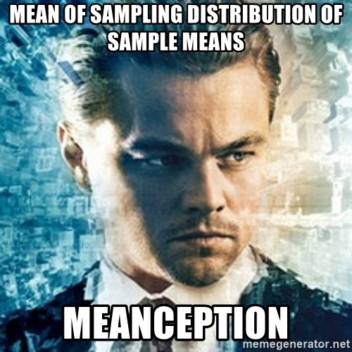



```{webr}
#| edit: false
#| output: false
#| autorun: true
quiet_library <- function(package) {
  suppressWarnings(suppressMessages(
    try(library(package, character.only = TRUE), silent = TRUE)
  ))
}

if (!exists("label", mode = "function")) {
  label <- function(x) {
    out <- attr(x, "label", exact = TRUE)
    if (is.null(out)) deparse(substitute(x)) else out
  }
}

if (!exists("var_label", mode = "function")) {
  var_label <- function(x) {
    out <- attr(x, "label", exact = TRUE)
    if (is.null(out)) deparse(substitute(x)) else out
  }
}

if (!exists("ggviolin", mode = "function")) {
  ggviolin <- function(data, x, y, fill = NULL, palette = NULL, add = NULL, add.params = list(), ...) {
    quiet_library("ggplot2")
    p <- ggplot2::ggplot(data, ggplot2::aes(x = .data[[x]], y = .data[[y]], fill = .data[[fill %||% x]])) +
      ggplot2::geom_violin(trim = FALSE, alpha = 0.7)
    if (!is.null(add) && "boxplot" %in% add) {
      p <- p + ggplot2::geom_boxplot(width = 0.12, fill = add.params$fill %||% "white", outlier.alpha = 0.35)
    }
    p
  }
}

if (!exists("ggpaired", mode = "function")) {
  ggpaired <- function(data, cond1, cond2, fill = NULL, line.color = "gray", line.size = 0.4, ...) {
    quiet_library("ggplot2")
    df <- data.frame(id = seq_len(nrow(data)), before = data[[cond1]], after = data[[cond2]])
    long <- rbind(
      data.frame(id = df$id, condition = cond1, value = df$before),
      data.frame(id = df$id, condition = cond2, value = df$after)
    )
    ggplot2::ggplot(long, ggplot2::aes(x = condition, y = value, group = id)) +
      ggplot2::geom_line(color = line.color, linewidth = line.size, alpha = 0.6) +
      ggplot2::geom_point(ggplot2::aes(fill = condition), shape = 21, size = 2)
  }
}

`%||%` <- function(x, y) if (is.null(x)) y else x

quiet_library("ggplot2")
quiet_library("dplyr")

UGA18<- readRDS("tutorials/Lab9/www/UGA18.Rda")
```

<div data-guided-lab data-lab-title="Lab 9"></div>

## Introduction

In this lab you will review variable distributions. Then we will explore why we use random samples, and the Central Limit Theorem (CTL) to make claims about the whole population. 

## Distribution Review

So hopefully you are starting to feel comfortable with the distributions we have been discussion in class. 

So why do we care about the distribution? The distributions determine the methods that you will apply when answering question. So the practical reason to care is so that you do well in the this class. In the bigger picture, using a generalized distribution allows us to make estimates beyond our sample of unobserved values, as well as making inferences about the population. In the exercise you will determine the best distribution to describe the variables in the data set.

### Exercise 1: Variable Distributions
  
For this exercise we will use some made up data for the whole UGA undergraduate population from 2018. During that year there were 29,611 students enrolled in undergraduate studies.     

The data set is named UGA18 and includes the following variables:   
**Sex:** Student sex (Male, Female)  
**Age:** Student age (years)   
**Weight:** Student weight (pounds)  
**Height:** Student height (inches)  
**Classes:** Number of classes for the current semester in college      

 
**Instructions** Use the interactive plot and summary below to determine the distributions for each of the variables. Then answer quiz questions 1-6.

```{=html}
<div class="lab-widget" data-uga-distribution data-csv="../tutorials/Lab9/www/UGA18.csv">
  <div class="lab-widget-controls">
    <label>Select Variable to Summarize
      <select data-uga-variable>
        <option value="sex">sex</option>
        <option value="age">age</option>
        <option value="weight">weight</option>
        <option value="height">height</option>
        <option value="classes">classes</option>
      </select>
    </label>
  </div>
  <div class="lab-split-widget">
    <div>
      <h4>Plot of Selected Variable</h4>
      <svg class="lab-plot" viewBox="0 0 760 420" role="img" aria-label="Plot of selected UGA variable"></svg>
    </div>
    <div>
      <h4>Data</h4>
      <div class="lab-table-count" data-uga-count></div>
      <div class="lab-table-wrap">
        <table class="lab-data-table">
          <thead></thead>
          <tbody></tbody>
        </table>
      </div>
    </div>
  </div>
  <h4>Summary of Selected Variable</h4>
  <div class="lab-table-wrap lab-summary-table-wrap">
    <table class="lab-data-table" data-uga-summary></table>
  </div>
</div>
```

### Quiz: Questions 1-6

<section class="lab-quiz" data-lab-quiz><h4>Question 1</h4><p>These summaries are showing the population parameters.</p>
<div class="lab-answers"><button type="button" class="lab-answer" data-correct="true">True</button>
<button type="button" class="lab-answer" data-correct="false">False</button></div>
<div class="lab-feedback" aria-live="polite"></div></section>
<section class="lab-quiz" data-lab-quiz><h4>Question 2</h4><p>Which distribution should we use to describe the variable <strong>sex</strong>?</p>
<div class="lab-answers"><button type="button" class="lab-answer" data-correct="false">Uniform</button>
<button type="button" class="lab-answer" data-correct="true">Binomial</button>
<button type="button" class="lab-answer" data-correct="false">Normal</button>
<button type="button" class="lab-answer" data-correct="false">Poisson</button></div>
<div class="lab-feedback" aria-live="polite"></div></section>
<section class="lab-quiz" data-lab-quiz><h4>Question 3</h4><p>Which distribution should we use to describe the variable <strong>age</strong>?</p>
<div class="lab-answers"><button type="button" class="lab-answer" data-correct="true">Uniform</button>
<button type="button" class="lab-answer" data-correct="false">Binomial</button>
<button type="button" class="lab-answer" data-correct="false">Normal</button>
<button type="button" class="lab-answer" data-correct="false">Poisson</button></div>
<div class="lab-feedback" aria-live="polite"></div></section>
<section class="lab-quiz" data-lab-quiz><h4>Question 4</h4><p>Which distribution should we use to describe the variable <strong>weight</strong>?</p>
<div class="lab-answers"><button type="button" class="lab-answer" data-correct="false">Uniform</button>
<button type="button" class="lab-answer" data-correct="false">Binomial</button>
<button type="button" class="lab-answer" data-correct="true">Normal</button>
<button type="button" class="lab-answer" data-correct="false">Poisson</button></div>
<div class="lab-feedback" aria-live="polite"></div></section>
<section class="lab-quiz" data-lab-quiz><h4>Question 5</h4><p>Which distribution should we use to describe the variable <strong>height</strong>?</p>
<div class="lab-answers"><button type="button" class="lab-answer" data-correct="false">Uniform</button>
<button type="button" class="lab-answer" data-correct="false">Binomial</button>
<button type="button" class="lab-answer" data-correct="true">Normal</button>
<button type="button" class="lab-answer" data-correct="false">Poisson</button></div>
<div class="lab-feedback" aria-live="polite"></div></section>
<section class="lab-quiz" data-lab-quiz><h4>Question 6</h4><p>Which distribution should we use to describe the variable <strong>classes</strong>?</p>
<div class="lab-answers"><button type="button" class="lab-answer" data-correct="false">Uniform</button>
<button type="button" class="lab-answer" data-correct="false">Binomial</button>
<button type="button" class="lab-answer" data-correct="false">Normal</button>
<button type="button" class="lab-answer" data-correct="true">Poisson</button></div>
<div class="lab-feedback" aria-live="polite"></div></section>
## Random Samples

Ok now that you have a good handle on the variables in the data we can start to explore the importance of random sampling.  

I can almost guarantee that you have done some sort of sampling in your life. When you go some where to get ice cream you probably tried a couple flavors before making a decision. The simple definition for a sample is a smaller part of a whole that gives you information (data) so that you have an idea of what to expect of the whole.  

In your personal life you chose samples because you think you will like them, which is great. Imagine if you could not get samples and after the first bite of your triple scope waffle cone you find out that you don't like it. In science choosing samples because you think they will give the result you want is called fraud. Even a researcher with the best intentions can unintentionally influence the results of an experiment if proper sampling methods are not used. The ultimate goal with any sampling method is to collect a sample that is representative of the population and for many situations the best way to do that is by randomly selecting members of a population. 

Getting data on an entire population in most cases is not practical or even necessary. Imagine your trying to decided on an ice cream flavor, you don't have to eat a whole gallon to decide if you like it, instead a small representative sample is enough to make a good decision. In a more real world example, imagine trying to collect data on the height of every undergraduate student enrolled at UGA (there were 29611 in 2018). Collecting data on the entire population would take a really long time and would be very expensive.  

So just like ice cream where you use a sample to know if you like it, in biostatistics a random sample can give you a very good idea of the "True" values of the populations parameters.  There are a number of methods to get a random sample. For a basic overview check out [Health Knowledge](https://www.healthknowledge.org.uk/public-health-textbook/research-methods/1a-epidemiology/methods-of-sampling-population). The National Health and Nutrition Examination Survey [NHANES](https://www.cdc.gov/nchs/nhanes/hlthprofess.htm) relies on a random sample and you whether you know it or not you have benefited from the information generated. You can see the complete list of data accomplishments on their [website](https://www.cdc.gov/nchs/nhanes/dataaccomp.htm), but here are just a few: growth charts (height and weight percentiles), acceptable cholesterol levels (low, normal, high), vitamin and mineral fortifications (adding iron to grains and cereals). 

### Exercise 2: Random Sampling

As stated above having access to an entire population is not always possible or practical. So now imagine that you do not have access to the whole UGA population but for whatever reason you are still interested in the sex, age, weight, height, and number of classes taken during the first semester of the undergraduate population. You don't have the time or money to collect data on the entire population so you will have to take a random sample. In the exercise below you will use random samples of different sizes and see how the estimates of different parameters change.  

The data set is named UGA18 and includes the following variables:    
**Sex:** Student sex (Male, Female)    
**Age:** Student age (years)    
**Weight:** Student weight (pounds)     
**Height:** Student height (inches)    
**Classes:** Number of classes for the current semester in college    

**Instructions:** Specify the size of the random sample you want to select from the UGA population. Use the random sample generator to answer the quiz questions.  

```{=html}
<div class="lab-widget" data-uga-sample data-summary-csv="../tutorials/Lab9/www/UGA18_sample_summary.csv">
  <div class="lab-widget-controls">
    <label>Specify a Random Sample Size
      <input type="number" min="1" max="10000" step="1" value="5" data-uga-sample-size>
    </label>
  </div>
  <h4>Compare the Population Parameter to the Statistics of a Random Sample</h4>
  <div class="lab-table-wrap">
    <table class="lab-data-table">
      <thead></thead>
      <tbody></tbody>
    </table>
  </div>
</div>
```

### Quiz: Questions 7-9

<section class="lab-quiz" data-lab-quiz><h4>Question 7</h4><p>What is the smallest sample size gives you an absolute difference less than 1 for all the variables?</p>
<div class="lab-answers"><button type="button" class="lab-answer" data-correct="false">n = 122 Students</button>
<button type="button" class="lab-answer" data-correct="false">n = 3 Students</button>
<button type="button" class="lab-answer" data-correct="true">n = 21 Students</button>
<button type="button" class="lab-answer" data-correct="false">n = 57 Students</button></div>
<div class="lab-feedback" aria-live="polite"></div></section>
<section class="lab-quiz" data-lab-quiz><h4>Question 8</h4><p>Set the sample size to 100. Record the absolute difference for all the variables. Now set the sample size to 10,000. For all the variables what are differences between the absolute differences of the two random samples?</p>
<div class="lab-answers"><button type="button" class="lab-answer" data-correct="true">0.006, 0.095, 0.239, 0.517, 0.077</button>
<button type="button" class="lab-answer" data-correct="false">0.009, 0.905, 0.923, 0.157, 0.577</button>
<button type="button" class="lab-answer" data-correct="false">0.029, 0.193, 0.536, 0.527, 0.127</button>
<button type="button" class="lab-answer" data-correct="false">0.927, 0.346, 0.749, 0.187, 0.420</button></div>
<div class="lab-feedback" aria-live="polite"></div></section>
<section class="lab-quiz" data-lab-quiz><h4>Question 9</h4><p>It is worth the extra time and money to collect the data for a sample of 10,000 compared to 100.</p>
<div class="lab-answers"><button type="button" class="lab-answer" data-correct="false">True</button>
<button type="button" class="lab-answer" data-correct="true">False</button></div>
<div class="lab-feedback" aria-live="polite"></div></section>
### Exercise 3: Size of Random Sample  

I am always surprised how well a relatively small sample can produce really good estimates of population parameters. In the last exercise we were looking at one sample at a time. In this exercise we will look at a range of sample sizes to get a better understanding of how sample estimates change as sample size increase.  

**Instructions:** Use the interactive plot below by selecting different variables. The plot shows estimates from different random sample sizes (1 to 5,000). **Pay attention to the y axis**. Use the plots to answer the quiz questions. 

```{=html}
<div class="lab-widget" data-uga-sample-size data-path-csv="../tutorials/Lab9/www/UGA18_sample_size_paths.csv">
  <div class="lab-widget-controls">
    <label>Select Variable to Summarize
      <select data-uga-path-variable>
        <option value="sex">sex</option>
        <option value="age">age</option>
        <option value="weight">weight</option>
        <option value="height">height</option>
        <option value="classes">classes</option>
      </select>
    </label>
    <label>Set X axis lower limit
      <input type="number" min="1" max="5000" step="1" value="1" data-uga-x-low>
    </label>
    <label>Set X axis upper limit
      <input type="number" min="1" max="5000" step="1" value="5000" data-uga-x-up>
    </label>
  </div>
  <h4>Random Samples of Varying Size</h4>
  <svg class="lab-plot" viewBox="0 0 760 460" role="img" aria-label="Random samples of varying size"></svg>
</div>
```

**Explanation of Plot:**   
The <span style="color:darkgreen">**green**</span> line shows the population parameter value for the variable you selected. Notice that is constant it will only change if the population changes.   
The <span style="color:blue">**blue**</span> line is the estimate from each of the random samples ranging in size from 1 to 5000. Notice that as the sample size increases the blue lines have less and less variation, and get closer and closer to the parameter value.   
The <span style="color:red">**red**</span> line is a smoothed line since it can be hard to see trends when there is so much variation. The red line was made by taking the mean of the means of 7 samples at a time. For example if we had 21 means we would end up with 3 means that are then connected by a "smooth" line. If you want to know more about "smoothing" data check out Rafael's book [Introduction to Data Science](https://rafalab.github.io/dsbook/smoothing.html).      

### Quiz: Questions 10-12

<section class="lab-quiz" data-lab-quiz><h4>Question 10</h4><p>Look at the plots for all the variables. For all the variables what happens to the estimates as the sample size increases? (X axis 1 to 5000)</p>
<div class="lab-answers"><button type="button" class="lab-answer" data-correct="false">Nothing worth mentioning</button>
<button type="button" class="lab-answer" data-correct="false">The graph is different for all the variables</button>
<button type="button" class="lab-answer" data-correct="false">There is not a clear pattern</button>
<button type="button" class="lab-answer" data-correct="true">The estimates become less variable and get closer to the parameter value as the sample size increases</button></div>
<div class="lab-feedback" aria-live="polite"></div></section>
<section class="lab-quiz" data-lab-quiz><h4>Question 11</h4><p>Why is the estimated mean age very close to the true mean even with a very small sample? (X axis to 1 and 100)</p>
<div class="lab-answers"><button type="button" class="lab-answer" data-correct="false">It is impossible to know</button>
<button type="button" class="lab-answer" data-correct="false">Just lucky</button>
<button type="button" class="lab-answer" data-correct="true">The range of possible values is small</button>
<button type="button" class="lab-answer" data-correct="false">Mostly do to biased sampling</button></div>
<div class="lab-feedback" aria-live="polite"></div></section>
<section class="lab-quiz" data-lab-quiz><h4>Question 12</h4><p>Why does the estimated mean weight take so long to before the red line is consistently near the true mean? (X axis to 1 and 1000)?</p>
<div class="lab-answers"><button type="button" class="lab-answer" data-correct="true">The weight variable has the most variation</button>
<button type="button" class="lab-answer" data-correct="false">weight is hard to measure accurately</button>
<button type="button" class="lab-answer" data-correct="false">Because no one reported their actual weight</button>
<button type="button" class="lab-answer" data-correct="false">Bad luck</button></div>
<div class="lab-feedback" aria-live="polite"></div></section>

## Central Limit Theorem

If you only remember one thing from this lab this should be it. **According to the central limit theorem, the distribution of the means from repeated samples of a population will be have an approximately normal distribution irrespective of the distribution if individual observations in the population. As long as the sample size is larger than 40**. In our UGA data set we have variables that have a normal, Poisson, binomial, and uniformly distributed. But according to the CTL if we took repeated samples of the same size and calculated the means of those samples the distribution of those means will be normally distributed.      

We are going to put this to the test in our next exercise.

### Exercise 4: Visualizing the CTL

**Instructions** choose different sample sizes and the number of times they are resampled. Use the plot to answer the quiz questions.

```{=html}
<div class="lab-widget" data-uga-clt data-csv="../tutorials/Lab9/www/UGA18.csv">
  <div class="lab-widget-controls">
    <label>Select Variable
      <select data-uga-clt-variable>
        <option value="sex">sex</option>
        <option value="age">age</option>
        <option value="weight">weight</option>
        <option value="height">height</option>
        <option value="classes">classes</option>
      </select>
    </label>
    <label>Sample size
      <input type="number" min="1" max="1000" step="1" value="40" data-uga-clt-size>
    </label>
    <label>Number of Repeated Samples
      <input type="number" min="1" max="10000" step="50" value="100" data-uga-clt-reps>
    </label>
  </div>
  <h4>Distribution of Sample Means</h4>
  <svg class="lab-plot" viewBox="0 0 760 430" role="img" aria-label="Distribution of sample means"></svg>
  <p class="lab-widget-note" data-uga-clt-note></p>
</div>
```

**Explanation of Plot:**  
The histogram shows the distribution of the means from all the repeated samples. The smoothed curve is the density of different mean values of the repeated samples. The vertical green line shows the value of the population parameter for the selected variable.  

### Quiz: Questions 13-17

<section class="lab-quiz" data-lab-quiz><h4>Question 13</h4><p>Does it work for Age? (Sample size:40, Repeated Samples:10000)</p>
<div class="lab-answers"><button type="button" class="lab-answer" data-correct="false">Yes it looks normal, but age is already normally distributed</button>
<button type="button" class="lab-answer" data-correct="false">No the curve is not even approximately bell shaped, and age is uniformly distributed</button>
<button type="button" class="lab-answer" data-correct="true">Yes it looks normal, even though age is uniformly distributed</button>
<button type="button" class="lab-answer" data-correct="false">There is not enough information to say</button></div>
<div class="lab-feedback" aria-live="polite"></div></section>
<section class="lab-quiz" data-lab-quiz><h4>Question 14</h4><p>Does it work for Weight? (Sample size:40, Repeated Samples:10000)</p>
<div class="lab-answers"><button type="button" class="lab-answer" data-correct="false">There is not enough information to say</button>
<button type="button" class="lab-answer" data-correct="true">Yes it looks normal, weight has a skewed distributed</button>
<button type="button" class="lab-answer" data-correct="false">No the curve is not even approximately bell shaped, and weight is skewed</button>
<button type="button" class="lab-answer" data-correct="false">Yes it looks normal, but weight is uniformly distributed</button></div>
<div class="lab-feedback" aria-live="polite"></div></section>
<section class="lab-quiz" data-lab-quiz><h4>Question 15</h4><p>Does it work for Height? (Sample size:40, Repeated Samples:10000)</p>
<div class="lab-answers"><button type="button" class="lab-answer" data-correct="false">No the curve is not even a little bell shaped</button>
<button type="button" class="lab-answer" data-correct="false">Yes it looks normal, even though height seems to have a Poisson distribution</button>
<button type="button" class="lab-answer" data-correct="false">There is not enough information to say</button>
<button type="button" class="lab-answer" data-correct="true">Yes it looks normal, height is normally distributed</button></div>
<div class="lab-feedback" aria-live="polite"></div></section>
<section class="lab-quiz" data-lab-quiz><h4>Question 16</h4><p>Does it work for Classes? (Sample size:40, Repeated Samples:10000)</p>
<div class="lab-answers"><button type="button" class="lab-answer" data-correct="true">Yes it looks normal, even though the classes variable is Poisson distributed</button>
<button type="button" class="lab-answer" data-correct="false">No one really knows</button>
<button type="button" class="lab-answer" data-correct="false">Yes it looks normal, but classes was already normally distributed</button>
<button type="button" class="lab-answer" data-correct="false">Look more like a negative binomial distribution</button></div>
<div class="lab-feedback" aria-live="polite"></div></section>
<section class="lab-quiz" data-lab-quiz><h4>Question 17</h4><p>Does it work for Sex? (Sample size:40, Repeated Samples:10000)</p>
<div class="lab-answers"><button type="button" class="lab-answer" data-correct="false">No!</button>
<button type="button" class="lab-answer" data-correct="true">Kinda of normal, it is a little jagged</button>
<button type="button" class="lab-answer" data-correct="false">Yes it looks perfectly normal</button>
<button type="button" class="lab-answer" data-correct="false">Still looks like a binomial distribution</button></div>
<div class="lab-feedback" aria-live="polite"></div></section>
## Summary

In this lab, you completed 4 exercises and answered 17 quiz questions. 

The lab covered 3 topics:

1. Review of distributions
2. Random sampling
3. Central Limit Theorem

You are done with lab! Time for some ice cream samples! **Don't forget to record your answers and take the eLC quiz to get credit**

{.lab-summary-image}

Ok, now that you are done. Here is a rabbit hole to explore that deals with a very practical reason for good sampling.

 How do clothing companies decide on sizes? What determines if a shirt is a small, medium, or large?
